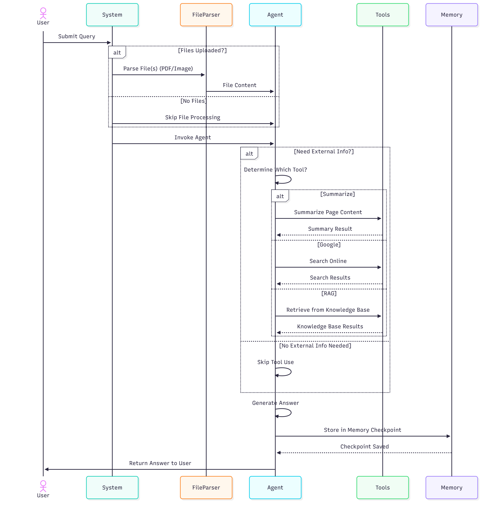
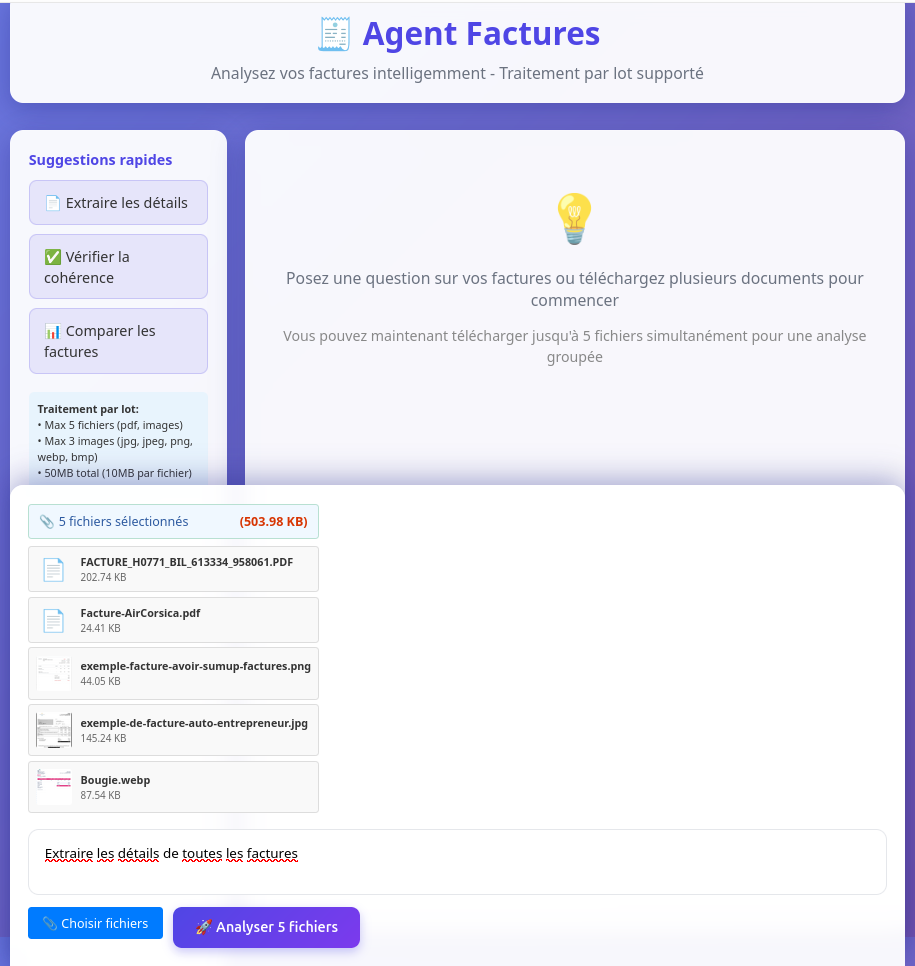
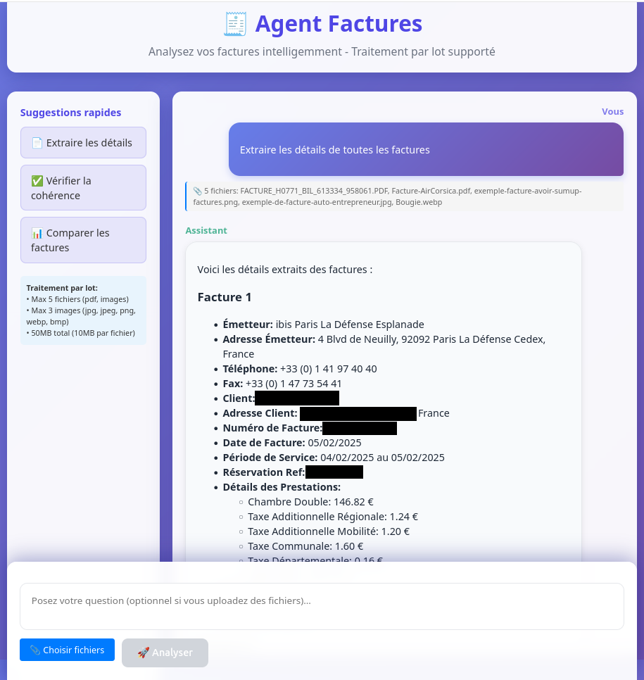
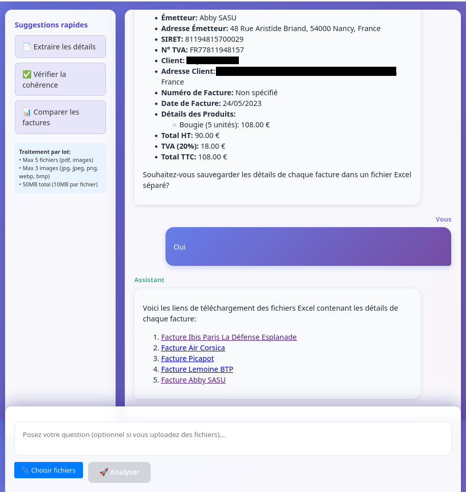
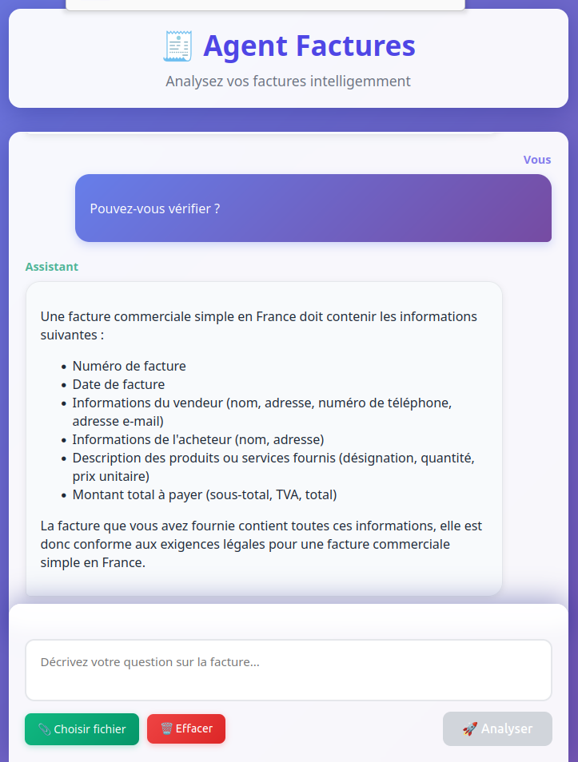
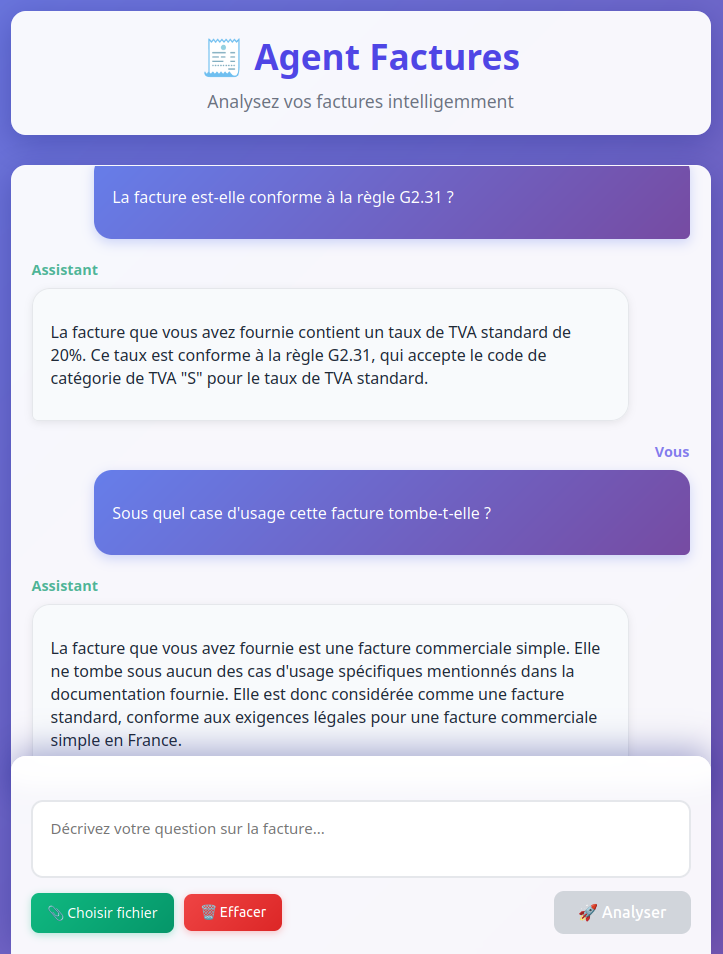
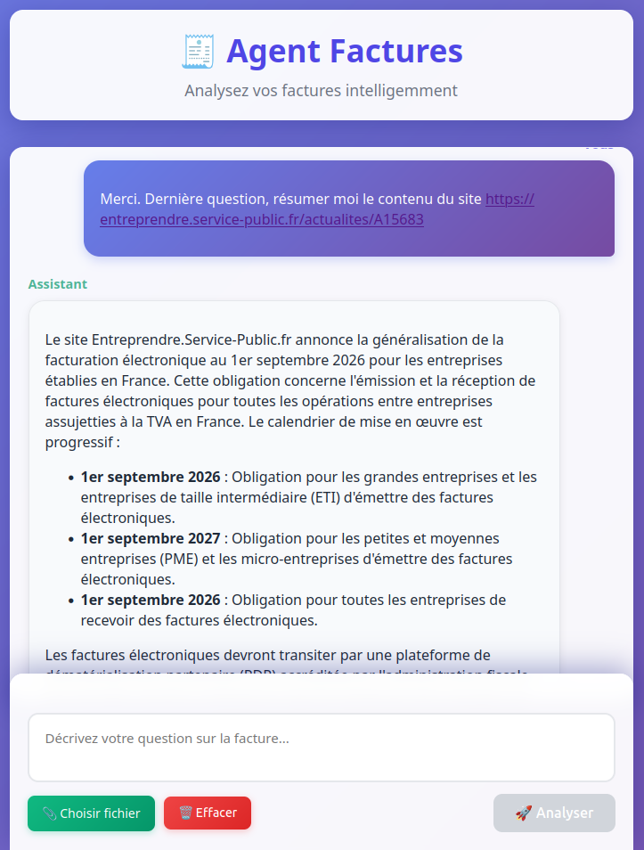
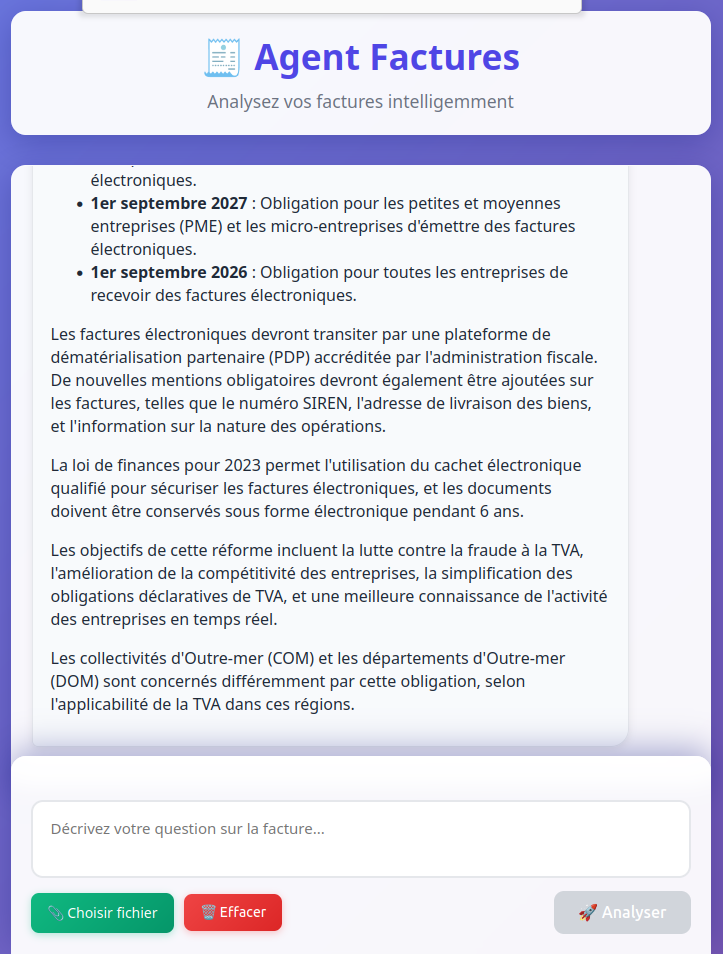

SCREENSHOTS BELOW!

# 🐍 Python Project Setup (Linux)

## 1. Clone the repository (make sure you have Git installed on your machine)

```bash
git clone https://github.com/Za3tour420/gestion_factures.git
cd gestion_factures
```

## 2. Create and activate a virtual environment

```bash
python3 -m venv venv
source venv/bin/activate
```

## 3. Configure environment variables (replace with your API keys)
```bash
cp .env.example .env
gedit .env  # or use your preferred editor
```

```env
GOOGLE_API_KEY=your-google-api-key
GOOGLE_CSE_ID=your-google-cse-id
NVIDIA_API_MISTRAL_MED=your-nvidia-api-key
```

## 4. Run setup_all.py to install all dependencies (root preferred)
```bash
python setup_all.py
```
Note: A package requires root access to install its dependencies. If you install without root, this step will be skipped and you have to install them manually.

## 5. Run the project
```bash
python3 run.py
```

## 6. Sequence Diagram


## 7. Agent Pipeline


## 8. Demo Screenshots
The following screenshots showcase the agent's ability to consult its knowledge bases, perform web search, extract and save relevant invoices information while sticking to the context (finance) without deviating.










