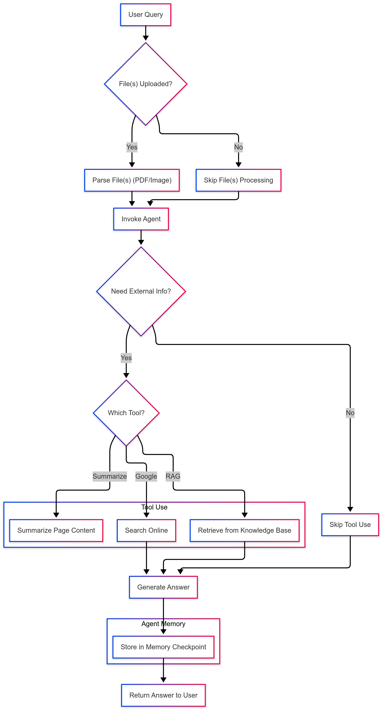

# 🐍 Python Project Setup

## 1. Create and Activate a Virtual Environment (Linux)

```bash
python3 -m venv venv
source venv/bin/activate
```

## 2. Export API Keys as Environment Variables

```bash
export GOOGLE_CSE_ID="your_google_cse_id"
export GOOGLE_API_KEY="your_google_api_key"
export NVIDIA_API_MISTRAL_MEDIUM3_INSTRUCT="your_nvidia_api_key"
```
To make them persistent for the current user, run the following:

```bash
echo 'export GOOGLE_CSE_ID="your_google_cse_id"' >> ./~bashrc
echo 'export GOOGLE_API_KEY="your_google_api_key"' >> ./~bashrc
echo 'export NVIDIA_API_MISTRAL_MEDIUM3_INSTRUCT="your_nvidia_api_key"' >> ./~bashrc

source ./~bashrc
```

## 3. Install Dependencies
```bash
pip install -r requirements.txt
```

## 4. Run the Project
```bash
python3 agentic.py
```

## 5. Actual Pipeline

